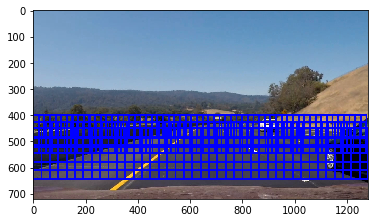
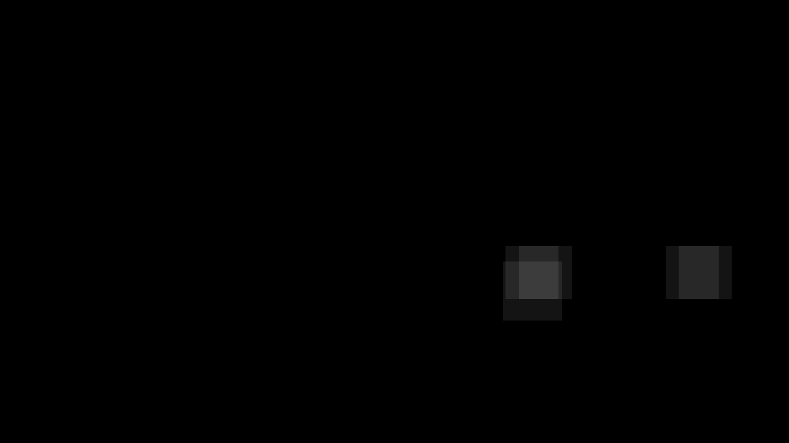

# Vehicle Detection Project #

The goals / steps of this project are the following:

* Perform a Histogram of Oriented Gradients (HOG) feature extraction on a labeled training set of images and train a classifier Linear SVM classifier
* Optionally, you can also apply a color transform and append binned color features, as well as histograms of color, to your HOG feature vector.
* Note: for those first two steps don't forget to normalize your features and randomize a selection for training and testing.
* Implement a sliding-window technique and use your trained classifier to search for vehicles in images.
* Run your pipeline on a video stream (start with the test_video.mp4 and later implement on full project_video.mp4) and create a heat map of recurring detections frame by frame to reject outliers and follow detected vehicles.
* Estimate a bounding box for vehicles detected.

[//]: # (Image References)
[random_car_not_car]: ./res/random_car_not_car.png
[car_hog_features]: ./res/car_hog_features.png
[not_car_hog_features]: ./res/not_car_hog_features.png
[class_distribution]: ./res/class_distribution.png
[radio_positives]: ./res/radio_positives.png
[image6]: ./examples/labels_map.png
[image7]: ./examples/output_bboxes.png
[video1]: ./project_video.mp4

## [Rubric](https://review.udacity.com/#!/rubrics/513/view) Points
### Here I will consider the rubric points individually and describe how I addressed each point in my implementation.

---
### Writeup / README

#### 1. Provide a Writeup / README that includes all the rubric points and how you addressed each one.  You can submit your writeup as markdown or pdf.

You're reading it!

### Histogram of Oriented Gradients (HOG)

#### 1. Explain how (and identify where in your code) you extracted HOG features from the training images.

The code for this step is contained in the first code cell of the IPython notebook.

I started by reading in all the `vehicle` and `non-vehicle` images.  Here is an example of one of each of the `vehicle` and `non-vehicle` classes:

![alt text][random_car_not_car]

I then explored different color spaces and different `skimage.hog()` parameters (`orientations`, `pixels_per_cell`, and `cells_per_block`).  I grabbed random images from each of the two classes and displayed them to get a feel for what the `skimage.hog()` output looks like.

Here is an example using the `YCrCb` color space and HOG parameters of `orientations=9`, `pixels_per_cell=(8, 8)` and `cells_per_block=(2, 2)`:

![alt text][car_hog_features]
![alt text][not_car_hog_features]

#### 2. Explain how you settled on your final choice of HOG parameters.

I tried various combinations of parameters in the following table

|Color Space|Color Features (hist/bin)|HOG Orientatins| Validation Accuracy|Video Performance |
|:----------:|:-----------------------:|:-------------:|:------------------------------------|
|HIS|N/A|9|95%|N/A|
|YUV|N/A|9|95%|N/A|
|YCrCb (Y only)|N/A|12|95%|N/A|
|YCrCb|Yes|9|98%|Too many False Positves|
|YCrCb|N/A|9|98%|Good|
|YCrCb|N/A|12|98%|Good|

`YCrCb` color space and HOG parameters of `orientations=9`, `pixels_per_cell=(8, 8)` and `cells_per_block=(2, 2)`
is chosen for the final pipeline.

#### 3. Describe how (and identify where in your code) you trained a classifier using your selected HOG features (and color features if you used them).

I trained a linear SVM using HOG features from all channels of `YCrCb` color space and HOG parameters of `orientations=9`, `pixels_per_cell=(8, 8)` and `cells_per_block=(2, 2)`.

Firstly the HOG features of each image (64x64) are reshaped into a vector `X`.
Secondly the class of each image is used to generate a second a vector `Y`.
Thirdly `X` and `Y` are split into training set and validation set using `sklearn.cross_validation.train_test_split`.
Fourthly `X` is normalised so that the model is not overfit to certain features.
Finally `X (train)` and `Y (tarin)` are pass to `SVM.fit()` to train the model.

```
Using: 9 orientations 8 pixels per cell and 2 cells per block
Feature vector length: 5292
11.41 Seconds to train SVC...
Test Accuracy of SVC =  0.9828
```

Datasets are also inspected to verify that they have balanced class distribution.

<div style="text-align:center">Class Distribtion in the whole data set<br></div>
<br>
<div style="text-align:center">Radio of Positive Examples in Training/Testing<br></div>

<div style="text-align:center">Prediction Examples<br></div>

### Sliding Window Search

#### 1. Describe how (and identify where in your code) you implemented a sliding window search.  How did you decide what scales to search and how much to overlap windows?

I decided to search the top of camera view using smaller scale of windows as cars are farther away, and search the bottom of camera view using bigger scale of windows as cars are closer. `75%` overlap (2 pixels per step) has been chosen to scan one area multiple times from differnet offsets.

<div style="text-align:center"></div>

#### 2. Show some examples of test images to demonstrate how your pipeline is working.  What did you do to optimize the performance of your classifier?

Ultimately I searched on three scales using YCrCb 3-channel HOG features, which provided a nice result. I found combining Color Histogram/Spatial Binning produced more false positives. Here are some example images:

<div style="text-align:center">test1.jpg<br></div>
<div style="text-align:center">test3.jpg<br></div>
<div style="text-align:center">test4.jpg<br></div>
<div style="text-align:center">test5.jpg<br></div>

---

### Video Implementation

#### 1. Provide a link to your final video output.  Your pipeline should perform reasonably well on the entire project video (somewhat wobbly or unstable bounding boxes are ok as long as you are identifying the vehicles most of the time with minimal false positives.)
Here's a [link to my video result](./output_videos/project_video.mp4)
Here's another video with combined lane detection [link to my video result](./output_videos/project_video_advanced_lane.mp4)


#### 2. Describe how (and identify where in your code) you implemented some kind of filter for false positives and some method for combining overlapping bounding boxes.

I recorded the positions of positive detections in each frame of the video.  From the positive detections I created a heatmap and then thresholded that map to identify vehicle positions.  I then used `scipy.ndimage.measurements.label()` to identify individual blobs in the heatmap.  I then assumed each blob corresponded to a vehicle.  I constructed bounding boxes to cover the area of each blob detected.

Here's an example result showing the heatmap from a series of frames of video, the result of `scipy.ndimage.measurements.label()` and the bounding boxes then overlaid on the last frame of video:

### Here are four frames and their corresponding heatmaps:
(Note that the scale of heat map has been adjusted for visualisation)

<div style="text-align:center"></div>
<div style="text-align:center"></div>
<div style="text-align:center"></div>
<div style="text-align:center"></div>

### Here the resulting bounding boxes are drawn onto the last frame in the series:
<div style="text-align:center"></div>
---

### Discussion

#### 1. Briefly discuss any problems / issues you faced in your implementation of this project.  Where will your pipeline likely fail?  What could you do to make it more robust?

The shortcomings in the current pipeline:
1. The extracted HOG features lose lots of useful features of a CAR, e.g., shape of glass, mirror, tyres, lights and plates. This will likely create a lot of false positves.
2. The result bounding boxes in final output are a bit wobbly.
3. The bounding box could disappaer in several consectutive frames because of the scaling of sliding windows.

To overcome these shortcomings I would like to the following approaches:
1. Replace HOGS/SVM with CNN even YOLO. CNN is more powerful and promising to "learn" all the distinguishing features of cars like human eyes.
2. Predict and average the bounding box position/size to make them more stable.
3. When we have a high confidence that a car should be present in the frame but is not found, consider searching with more scales of sliding windows.
